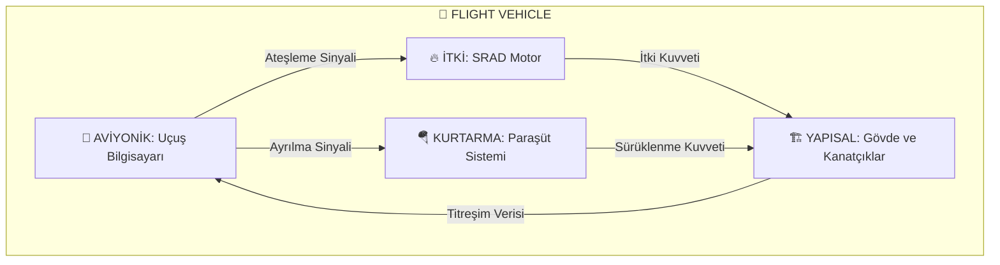

# 🚀 KTU GÖKÇEN: PROXIMA MISSION REPOSITORY


> **"Mükemmellik bir eylem değil, bir alışkanlıktır."**
> Bu depo, KTÜ Gökçen Roket Takımı'nın Spaceport America Cup (IREC) 30k SRAD kategorisi için geliştirdiği "Proxima" roketinin teknik dokümantasyonunu ve mühendislik araçlarını içerir.

<div align="center">

  

[**📜 YOL HARİTASI**](ROADMAP.md) • [**📚 KAYNAKLAR**](docs/RESOURCES.md) • [**📖 SÖZLÜK**](docs/GLOSSARY.md) • [**🧪 MALZEME**](docs/04_Subsystems_&_Payload/03_Aerostructures/Material_Properties.md) • [**📋 PROSEDÜRLER**](docs/03_Safety_&_SRAD/Checklists/)

</div>

---

## 📋 1. PROJE VE GÖREV TANIMI (Mission Definition)
**Proje Adı:** Proxima
**Yarışma:** Spaceport America Cup (IREC)
**Konum:** New Mexico, ABD
**Hedef:** 4 kg (8.8 lb) bilimsel faydalı yükü 30,000 ft irtifaya taşımak ve güvenli bir şekilde kurtarmak.

### 🏆 Yarışma Kategorisi: 30k SRAD
Takımımız, yarışmanın en zorlu ve prestijli kategorisi olan **30,000 ft - Student Researched and Developed (SRAD)** kategorisinde yarışmaktadır.

| Parametre | Değer | Açıklama |
| :--- | :--- | :--- |
| **Hedef İrtifa** | 30,000 ft (AGL) | Yaklaşık 9,144 metre. |
| **Motor Tipi** | SRAD (Öğrenci Yapımı) | Hibrit veya Katı Yakıtlı motor tasarımı ve üretimi tamamen takıma aittir. |
| **Faydalı Yük** | 4 kg (Min) | 3U CubeSat form faktöründe bilimsel deney. |

---

## 📂 2. DOKÜMANTASYON VE NAVİGASYON REHBERİ
Bu repo, binlerce satır kod ve teknik dokümandan oluşur. Aradığınızı bulmanız için rehber:

| Belge | Fragman (İçerik Özeti) | Erişim |
| :--- | :--- | :--- |
| **📜 YOL HARİTASI** | Projenin 2 yıllık stratejik "Master Planı". Hangi aşamadayız, sırada ne var? | [👉 Detaylar](ROADMAP.md) |
| **📚 KAYNAKLAR** | "Nasıl Kazanılır?" IREC şampiyonlarının raporları, kritik kitaplar ve eğitim videoları. | [👉 Kütüphaneye Git](docs/RESOURCES.md) |
| **📖 SÖZLÜK** | CATO, Apogee, SRAD ne demek? Roketçilik terminolojisine hakim olun. | [👉 Öğren](docs/GLOSSARY.md) |
| **🧪 MALZEME VERİSİ** | Analizler için gerekli gerçek "Engineering Data". (Alüminyum 6061, Karbon Fiber vb.) | [👉 Verileri Al](docs/04_Subsystems_&_Payload/03_Aerostructures/Material_Properties.md) |
| **📋 PROSEDÜRLER** | Roketi patlatmadan uçurmak için: Montaj, Rampa ve Kurtarma adım adım kontrol listeleri. | [👉 Uygula](docs/03_Safety_&_SRAD/Checklists/) |
| **🛡️ SAVAŞ KURALLARI** | Repoya kod gönderirken uymanız gereken disiplin kuralları. | [👉 Oku](CONTRIBUTING.md) |

---

## ⚖️ 3. MÜHENDİSLİK İLKELERİ (Core Principles)
Bu proje, havacılık ve uzay endüstrisi standartlarına (NASA/ESA) uygun olarak yürütülmektedir.

1.  **Veri Odaklı Karar Alma:** Tüm tasarım kararları; simülasyon, analiz ve test verilerine dayanır. "Tahmin" değil, "Doğrulama" esastır.
2.  **Önce Güvenlik (Safety First):** Havacılık kuralları tavizsiz uygulanır. Kritik sistemlerde yedeklilik (redundancy) zorunludur.
3.  **Dokümantasyon:** Yapılan her test, tasarım ve analiz yazılı olarak kayıt altına alınır. İzlenebilirlik (Traceability) esastır.
4.  **Risk Yönetimi:** Olası tüm hata senaryoları önceden analiz edilir (FMEA) ve önleyici tedbirler alınır.

---

## 📐 3. SİSTEM MİMARİSİ VE METODOLOJİ
Proje, **Design-Build-Fly** döngüsü ve **V-Model** sistem mühendisliği yaklaşımı ile yönetilir.

### Alt Sistem Etkileşim Şeması


### Geliştirme Süreci
*   **Tasarım (Design):** SolidWorks (CAD), OpenRocket/RASAero (Simülasyon), Altium (PCB).
*   **Üretim (Build):** Kompozit sarım (Filament Winding), CNC işleme, 3D baskı (PETG/Nylon).
*   **Test & Uçuş (Fly):** Statik Ateşleme Testleri, HIL (Hardware-in-the-Loop) simülasyonları, Test uçuşları.

---

## �️ 4. DİJİTAL MÜHENDİSLİK ARAÇLARI (Engineering Tools)
Proje kapsamında geliştirilen özel Python analiz araçları `analysis/` dizininde bulunmaktadır.

**Kurulum:**
```bash
pip install -e .
```

**Araç Listesi:**
| Araç | Açıklama | Komut |
| :--- | :--- | :--- |
| **Parachute Sizing** | İniş hızı ve darbe enerjisi hesabı. | `python analysis/calculators/parachute_sizing.py` |
| **Link Budget** | RF Telemetri menzil analizi (Friis). | `python analysis/calculators/link_budget.py` |
| **Thrust Analyzer** | Motor test verisi analizi. | `python analysis/calculators/thrust_analyzer.py` |

---

## ⚠️ 5. RİSK ANALİZİ VE TEKNİK ZORLUKLAR
Projenin başarısı için aşağıdaki teknik riskler dikkatle yönetilmelidir:

<details>
<summary>� <b>Detaylı Risk Analizini Görüntüle</b> (Tıklayın)</summary>

### 🚩 Yapısal Bütünlük (Structural Integrity)
*   **Fin Flutter:** Transonik hızlarda kanatçık rezonansı. *Çözüm: Yüksek modüllü karbon fiber kullanımı ve ANSYS modal analiz.*
*   **Gövde Burkulması:** Yüksek itki altında gövde deformasyonu. *Çözüm: Filament winding tekniği.*

### 🚩 Aviyonik Sistemler
*   **RF İletişim Kaybı:** Karbon fiber gövdenin sinyali bloke etmesi. *Çözüm: RF şeffaf burun konisi ve harici anten yerleşimi.*
*   **Pil Güvenliği:** Vakum ortamında Li-Po pil şişmesi. *Çözüm: Basınç testli Li-Ion piller.*

### 🚩 İtki Sistemi
*   **Termal Erozyon:** Nozzle boğazının erimesi. *Çözüm: Yüksek yoğunluklu grafit malzeme.*

</details>

---

## 📚 6. REFERANSLAR VE KAYNAKLAR
Teknik literatür, geçmiş yıl raporları ve standartlar için kütüphanemizi ziyaret edin:

**� [TÜM KAYNAKLARA GİT (RESOURCES.md)](docs/RESOURCES.md)**

*   **Raporlar:** McGill, Waterloo, Stanford teknik raporları.
*   **Kitaplar:** *Rocket Propulsion Elements* (Sutton), *Modern High Power Rocketry*.
*   **Yazılımlar:** OpenRocket, RASAero, BurnSim.

---

## 📞 İLETİŞİM
Kurumsal iletişim ve sponsorluk için:

*   🌐 **Web:** [gokcenrocket.org](https://gokcenrocket.org)
*   📧 **E-Posta:** contact@gokcenrocket.org
*   💼 **LinkedIn:** [linkedin.com/company/ktugokcen](https://linkedin.com/company/ktugokcen)

---
### ⚖️ Yasal Uyarı (Disclaimer)
Bu depo, akademik ve eğitim amaçlıdır. İçerikteki bazı teknolojiler (özellikle itki ve navigasyon sistemleri), uluslararası ihracat kontrol düzenlemelerine (EAR/ITAR) tabi olabilir. Kullanıcılar, yerel ve uluslararası yasalara uymakla yükümlüdür.
