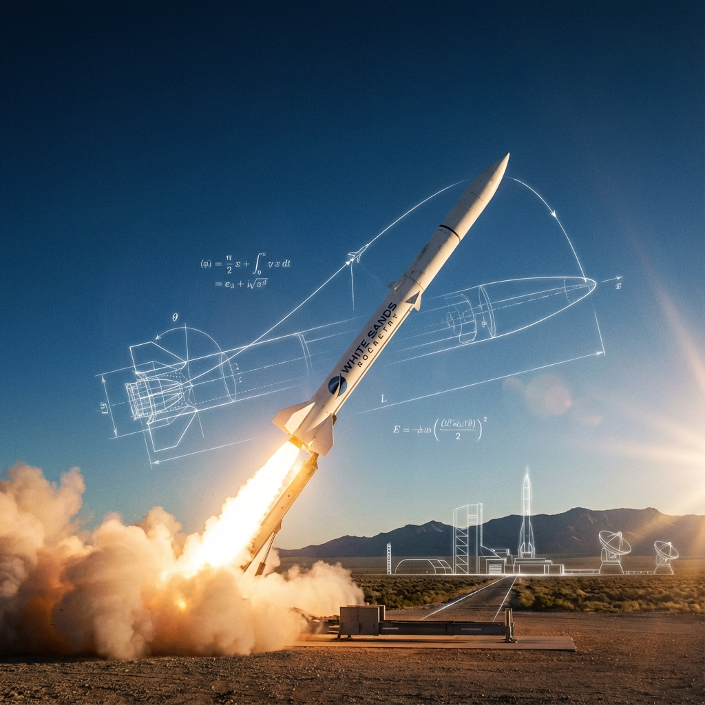
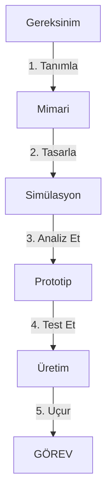

# 🦅 PROXIMA: THE IREC DOCTRINE | KTU GÖKÇEN

> **"Vasatlık İhanettir."**
> Spaceport America Cup (IREC) bir öğrenci kulübü etkinliği değildir. Burası, mühendisliğin **Olimpiyatlarıdır**. Ya mükemmel olursunuz ya da çöle çakılırsınız.

  

[**📜 MANİFESTO (ROADMAP)**](ROADMAP.md) • [**💀 FAILURE MODES**](#-neden-çakilacaği-failure-modes) • [**📚 KUTSAL KÜTÜPHANE**](#-kutsal-kütüphane-the-library) • [**🛡️ SAVAŞ KURALLARI**](CONTRIBUTING.md)

---

## ⚡ 0. MÜHENDİSLİK YEMİNİ (The Code)
Bu projeye adım atan herkes şu değişmez yasaları kabul eder:
1.  **Veri > Ego:** "Bence böyle olur" cümlesi yasaktır. "Simülasyon sonucu bu" cümlesi geçerlidir.
2.  **Fizik Affetmez:** Bir vida gevşekse, 10,000 feet'te o vida kopar. Roketiniz milyon dolarlık bir hurdaya döner.
3.  **Yazılmamışsa, Yapılmamıştır:** Testi video ile, tasarımı rapor ile kanıtlamazsanız, o işi yapmamış sayılırsınız.
4.  **Murphy Kanunu:** Ters gidebilecek her şey, en kötü zamanda (Fırlatma Anında) ters gider. Yedekleyin (Redundancy).

---

## 🏛️ 1. SAVAŞ ALANI: Spaceport America
Burası New Mexico çölü. **ESRA (Experimental Sounding Rocket Association)** tarafından yönetilen, Boeing ve Blue Origin'in izlediği yer.
*   **Düşman:** Yer çekimi, $Ma \approx 1.0$ şok dalgaları, 45°C çöl sıcağı.
*   **Hedef:** 10lb (4kg) faydalı yükü, tam olarak 10,000 veya 30,000 feet'e çıkarmak ve tek parça geri indirmek.
*   **Puanlama:** %50 Uçuş Başarısı + %50 Teknik Rapor Kalitesi. Raporunuz kötüyse, roketiniz Ay'a gitse bile kaybedersiniz.

---

## 💀 2. NEDEN ÇAKILACAĞIZ? (Failure Modes)
Roketler bu yüzden düşer. Ezberleyin.

### 🚩 Yapısal İflas (Structural Failure)
*   **Fin Flutter:** Kanatçıklar ses hızına yaklaşırken ($Ma=0.8+$) rezonansa girer ve kağıt gibi yırtılır.
    *   *Çözüm:* Karbon fiber kullanımı ve ANSYS Modal Analiz.
*   **Gövde Burkulması (Buckling):** İtki kuvveti gövdeyi ezer.
    *   *Çözüm:* El yatırması (Hand Lay-up) değil, **Filament Winding** teknolojisi.

### 🚩 Aviyonik Kâbuslar
*   **RF Blackout:** GPS sinyali metal gövdeden çıkamaz.
    *   *Çözüm:* RF şeffaf burun konisi veya harici anten.
*   **Pil Patlaması:** LiPo piller vakumda şişer ve yanar.
    *   *Çözüm:* Sadece Li-Ion veya Military-Grade NiMH piller. Vakum testi zorunlu.
*   **Sensör Gürültüsü:** Titreşim yüzünden ivmeölçer "duruyoruz" sanır, erkenden paraşüt açar (Zipper Effect).
    *   *Çözüm:* **Kalman Filtresi** ve Mekanik Low-Pass Filtre (Sünger yataklama).

### 🚩 İtki Sürprizleri (CATO)
*   **Nozzle Erozyonu:** Grafit nozzle, 3000K sıcaklıkta erir, boğaz çapı genişler, itki düşer.
    *   *Çözüm:* Yüksek yoğunluklu grafit veya fenolik liner.

---

## 📚 3. KUTSAL KÜTÜPHANE (The Library)
"Amerika'yı yeniden keşfetme. Devlerin omuzlarına bas."

### 🏆 Şampiyonların Raporları (Must Read)
| Takım | Odak | Link |
| :--- | :--- | :--- |
| **McGill (Kanada)** | Sistem Mimarisi & Test Disiplini | [📄 PDF Oku](https://www.scribd.com/document/384666468/McGill-Rocket-Team-IREC-2018-Project-Technical-Report) |
| **Waterloo (Kanada)** | SRAD Hibrit Motor Fizibilitesi | [📄 PDF Oku](https://www.scribd.com/document/660429783/Team-139-Waterloo-Final-Report-2022-IREC) |
| **Stanford (ABD)** | Safety Critical Avionics | [📄 PDF Oku](https://purl.stanford.edu/jv222sn2742) |

### 🛠️ Dijital Cephanelik (GitHub Repoları)
| Araç | Ne İşe Yarar? | Dil/Platform |
| :--- | :--- | :--- |
| **RocketPy** | 6-DOF Uçuş Simülasyonu (OpenRocket'in babası) | 🐍 Python |
| **NASA F´ (F Prime)** | Uzay sınıfı Gömülü Yazılım Framework'ü | ⚙️ C++ |
| **PSAS Avionics** | Hazır Aviyonik Kart Şemaları (Kopyala/Geliştir) | 🔌 KiCad |
| **OpenRocket** | Tasarım ve Stabilite Analizi | ☕ Java |

---

## 📐 4. TEKNİK DOKTRİN (V-Model)
Biz NASA standartlarında çalışırız. Asla "kodla ve gör" yapmayız.

*   **Alt Sistemler:**
    *   [🚀 İtki (Propulsion)](docs/04_Subsystems_&_Payload/01_Propulsion/README.md): $I_{sp}$, Yanma Odası Basıncı.
    *   [📟 Aviyonik (Avionics)](docs/04_Subsystems_&_Payload/02_Avionics/README.md): STM32, Sensör Füzyonu.
    *   [🏗️ Yapısal (Aerostructures)](docs/04_Subsystems_&_Payload/03_Aerostructures/README.md): Kompozit Üretim.
    *   [🪂 Kurtarma (Recovery)](docs/04_Subsystems_&_Payload/04_Recovery/README.md): Dual Deployment.

---

## 🚀 5. OPERASYON: LAUNCH DAY (T-Minus 0)
O gün geldiğinde, panik yapan kaybeder.

| Saat (T-) | Event | Kritik Kontrol |
| :--- | :--- | :--- |
| **05:00** | 🌅 **Deployment** | 4L Su İç (Dehidrasyon = Hata). |
| **08:00** | 👮 **LCO Check** | Radyo Frekans Çakışması Kontrolü. |
| **09:00** | 🚀 **Rail Load** | Ray sürtünme katsayısı (WD-40). |
| **09:15** | 💣 **Continuity** | Ateşleyici direnci < 50 Ohm olmalı. |
| **10:00** | 🔥 **IGNITION** | *Ad Astra Per Aspera.* |

---

## 📞 İLETİŞİM (Intel)
Gökçen Roket Takımı bir kulüp değil, bir **aile** ve bir **fikirdir**.

*   🌐 **HQ:** [gokcenrocket.org](https://gokcenrocket.org)
*   📧 **Secure Line:** contact@gokcenrocket.org
*   💼 **Network:** [LinkedIn](https://linkedin.com/company/ktugokcen)

> *"Gelecek Göklerdedir."* - M.K. Atatürk
